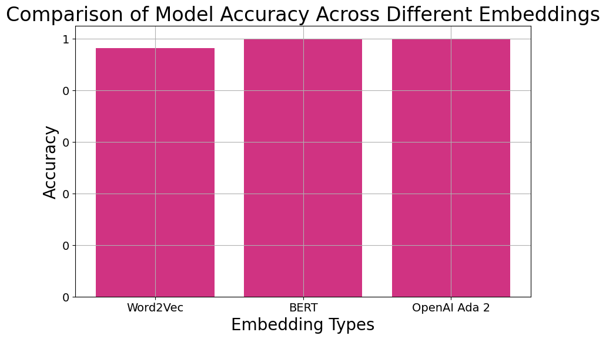
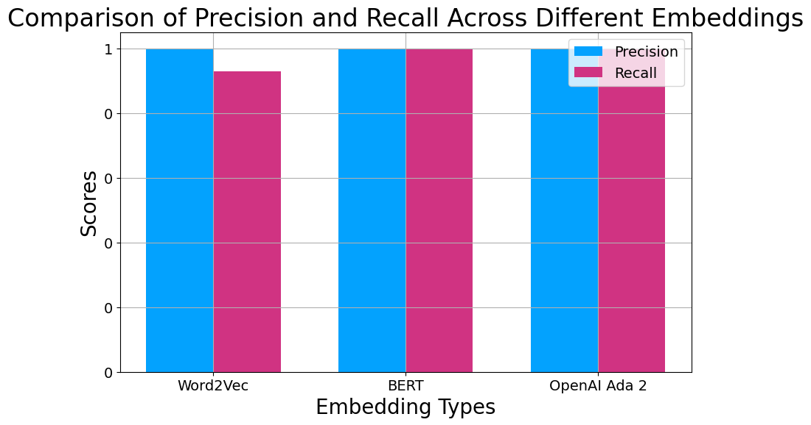
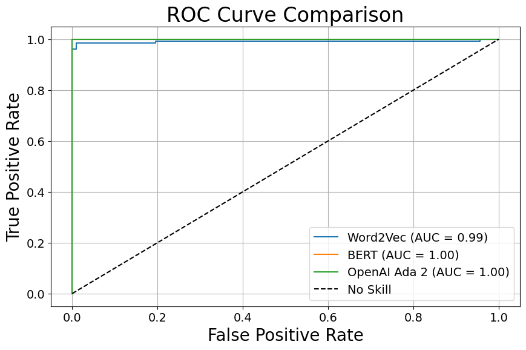
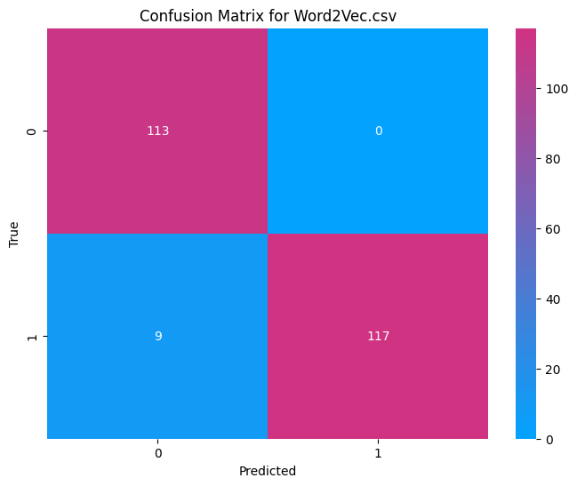
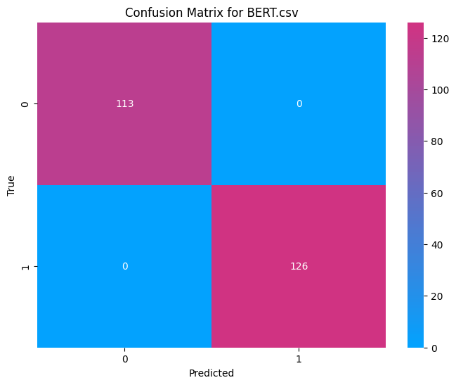

# Text Classification with Various Embedding Techniques

This repository contains a Jupyter notebook that explores text classification using different word embedding techniques. The notebook demonstrates the process of generating embeddings, training logistic regression models, and evaluating their performance.

## Contents

- `Custom_Classifier.ipynb`: The main Jupyter notebook with the entire workflow.
- `data/labeled.csv`: A labeled dataset generated with the help of GPT 3.5.
- `images`: Plot images rendered by the notebook, saved to the repository for use in this README.

## Features

- Comparison of Word2Vec, BERT, OpenAI Ada 2, and other embedding techniques.
- Model training and evaluation including accuracy, precision, recall, and ROC-AUC metrics.
- Detailed visualizations for model comparison.

## Usage

To run the notebook:
1. Clone the repository.
2. Install required dependencies.
3. Run the Jupyter notebook.

You'll need to provide an OpenAI API key if you want to generate embeddings with Ada 2.

### Alternative

Go [here](https://colab.research.google.com/drive/1THEqXHIvy1IEAzVLvB0rVwwSW30jZ5Ku?usp=sharing) and run it for free on Google Colab.  You'll need to upload the `labeled.csv` data file from this repository.  A free Colab notebook can handle the model training and the BERT embeddings, no problem.

## Contributing

Contributions to improve the notebook or add more embedding techniques are welcome. Please follow the standard GitHub pull request process.

## License

[MIT License](LICENSE)

## Contact

For questions and feedback, please open an issue in the repository.

## Explanation

We are faced with a hypothetical yet practical challenge: building a text classifier to identify sentences that inquire about Spanish immigration law. In simpler terms, we want to create a tool that reads a sentence and can instantly tell us whether someone is asking a question that relates to the legalities of immigrating to Spain. This is not a trivial task, as the subtleties of language mean that questions can be phrased in countless ways, each with its own linguistic nuances. Our goal is to design a system that understands and interprets these nuances with high accuracy.

In the first phase of our classifier's architecture, each sentence is transformed into a numerical pattern, known as an embedding. These embeddings are like secret codes that distill the sentence down to its core meaning in a numerical form. We have a special tool that can measure how "similar" these codes are, giving us a number that represents the degree of similarity between any two sentences.

But here’s the catch: while we can measure similarity, we initially don't know what degree of similarity is needed to confidently say that a sentence is indeed asking about Spanish immigration law. This is where the machine learning model comes into play.

In the second phase, the machine learning model steps in to solve this precise problem. It learns from examples—numerical patterns that we already know are questions about the law and patterns that we know are not. By analyzing these examples, the model establishes a benchmark for similarity. It effectively says, "If two embeddings are this close or closer, then I consider the sentence to be about Spanish immigration law." It's like training a friend to recognize a tune by playing them songs and then asking them to identify when they hear a melody that closely matches the ones they've learned.

### Embedding Techniques

**Word2Vec**: A pioneering model in word embeddings, Word2Vec creates vector spaces where words that share context in the corpus are positioned closely in the space. This is achieved using shallow neural networks with two architectures, Continuous Bag of Words (CBOW) and Skip-Gram, each predicting words given context and vice versa.

**BERT**: Developed by Google AI, BERT (Bidirectional Encoder Representations from Transformers) represents the cutting edge in context-aware embeddings. Unlike Word2Vec, BERT reads entire sequences of words to understand context, capturing nuances in meaning that arise with changes in word order, making it deeply bidirectional.

**OpenAI's Ada 2**: As a variant of the GPT family, Ada 2 uses a transformer architecture to produce embeddings. It's trained on a diverse set of texts and tasks, allowing it to generate versatile and robust representations. Its embeddings encapsulate broader contexts than Word2Vec, and it can be fine-tuned for specific applications, similar to BERT.

While embeddings provide dense and informative representations of text, they do not inherently distinguish between classes. A machine learning classifier is required to map these embeddings onto a target label. We chose a logistic regression model, a probabilistic linear classifier that's effective for binary classification tasks. It uses the embeddings as input to predict the probability that a sentence pertains to Spanish immigration law.

### Classifier Training

The training process involved feeding the embeddings into the logistic regression model, which then adjusted its weights through optimization algorithms to minimize prediction errors. This was done using a portion of the data reserved for training, allowing the model to learn from known outcomes.

### Evaluation Metrics

**Accuracy**: The ratio of correctly predicted instances to the total instances, providing a general measure of the model's performance.

**Precision**: Out of all the instances predicted as positive, precision tells us how many were actually positive.

**Recall**: Out of all actual positive instances, recall tells us how many we correctly predicted as positive.

**ROC-AUC Score**: The ROC curve plots the true positive rate against the false positive rate at various threshold settings, and the AUC score quantifies the overall ability of the model to discriminate between classes.

**Confusion matrices**: A confusion matrix is a table used to describe the performance of a classification model. It lays out the instances where the model made correct predictions (true positives and true negatives) against the times it was mistaken (false positives and false negatives).

## Results

The evaluation metrics give us a comprehensive understanding of the model's performance, considering various aspects of prediction accuracy and error types.

### Accuracy

The bar chart visualizing accuracy shows that BERT and Ada 2 achieved high accuracy, indicating their strong performance on this classification task.

### Precision and Recall

The precision-recall bar chart compares the models' precision (the ratio of true positives to total predicted positives) and recall (the ratio of true positives to actual positives), where BERT and Ada 2 excel, demonstrating their reliability in classification.

### ROC Curve

The ROC curve image illustrates the trade-off between sensitivity and specificity for each embedding method. BERT and Ada 2's curves are closer to the top-left corner, indicating higher performance, with Word2Vec slightly behind.

### Confusion Matrices

The confusion matrix images for each model show that BERT and Ada 2 had fewer false positives and false negatives compared to Word2Vec, although all three had commendable true positive rates.

## Conclusions

BERT's performance being on par with Ada 2 suggests that despite the complexity and power of large language models (LLMs), in specific scenarios, simpler models like BERT can provide equally impressive results. Word2Vec's respectable performance also highlights that even older models can be sufficiently effective for certain use cases. The key takeaway is that the most powerful and expensive models may not always be necessary; the choice of model should be guided by the specific needs and constraints of your business use case.